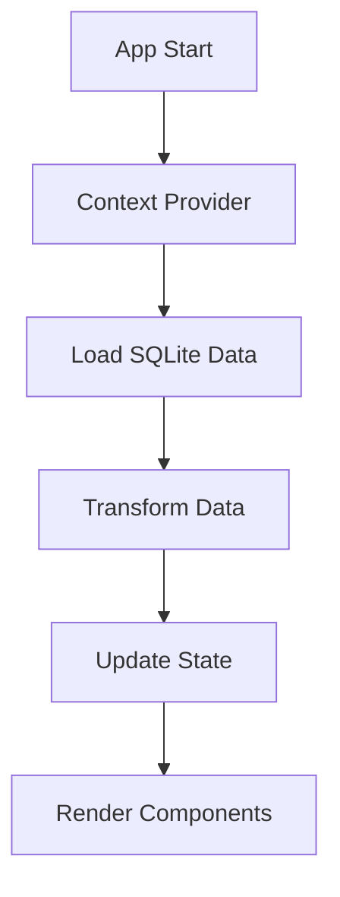

# 🔧 Guia Técnico - Sistema de Gestão Jurídica

## 📋 Índice
- [Arquitetura do Sistema](#arquitetura-do-sistema)
- [Estrutura de Dados](#estrutura-de-dados)
- [Componentes Principais](#componentes-principais)
- [Fluxo de Dados](#fluxo-de-dados)
- [Integração com SQLite](#integração-com-sqlite)
- [Sistema de IA](#sistema-de-ia)
- [Performance e Otimização](#performance-e-otimização)

## 🏗️ Arquitetura do Sistema

### Arquitetura Geral
```
┌─────────────────┐    ┌─────────────────┐    ┌─────────────────┐
│   Data Layer    │────│  Business Logic │────│   UI Layer      │
│                 │    │                 │    │                 │
│ • SQLite Data   │    │ • Context API   │    │ • React Comps   │
│ • Mock Data     │    │ • State Mgmt    │    │ • Tailwind CSS  │
│ • JSON Export   │    │ • Data Transform│    │ • Lucide Icons  │
└─────────────────┘    └─────────────────┘    └─────────────────┘
```

### Stack Tecnológico Detalhado
- **Core**: React 18.2+ com TypeScript 5.0+
- **Build Tool**: Vite 4.0+ (ESM, HMR)
- **Styling**: Tailwind CSS 3.3+
- **Icons**: Lucide React 0.263+
- **Routing**: React Router v6.14+
- **Date Handling**: date-fns 2.30+
- **Utilities**: clsx para classes condicionais

## 📊 Estrutura de Dados

### Interface Principal: HealthInsuranceProcess
```typescript
interface HealthInsuranceProcess {
  id: string;
  numero_processo: string;
  link_processo: string;
  data_extracao_dados: string;
  partes_principais: string;
  
  // Classificação médica e jurídica
  classificacao_demanda: {
    especialidade_medica: MedicalSpecialty;
    tipo_demanda: DemandType;
    procedimento_especifico: string;
    carater_urgencia: 'urgente' | 'emergencia' | 'eletivo';
  };
  
  // Aspectos financeiros
  aspectos_financeiros: {
    valor_inicial_causa: number;
    valor_multa_diaria?: number;
    custos_estimados_defesa?: number;
  };
  
  // Métricas para dashboard
  metricas_dashboard: {
    score_urgencia: number;
    score_complexidade: number;
    score_impacto_financeiro: number;
    prioridade_gestao: ManagementPriority;
    status_semaforo: TrafficLightStatus;
    requer_escalacao_executiva: boolean;
  };
  
  // Timeline e cronologia
  cronologia_processual: {
    dias_tramitacao_total: number;
    processo_ativo: boolean;
    ultima_movimentacao?: string;
  };
  
  // Decisões judiciais
  decisoes_judiciais?: {
    liminar_antecipacao?: {
      deferida: boolean;
      data_decisao?: string;
    };
  };
  
  // Status atual
  status_atual: {
    risco_multa_crescente: boolean;
  };
  
  // Dados completos da análise LLM
  analise_llm?: any;
  linha_tempo_otimizada?: any[];
  detalhes_capa_processual?: string;
  ultimo_movimento_processo?: string;
}
```

### Tipos Especializados
```typescript
type MedicalSpecialty = 
  | 'cardiologia' | 'oncologia' | 'neurologia'
  | 'ortopedia' | 'psiquiatria' | 'gastroenterologia'
  | 'ginecologia' | 'pediatria' | 'urologia'
  | 'oftalmologia' | 'dermatologia' | 'endocrinologia'
  | 'reumatologia' | 'hematologia' | 'nefrologia'
  | 'pneumologia' | 'outros';

type DemandType = 
  | 'cobertura_negada' | 'reajuste_contratual'
  | 'prazo_autorizacao' | 'rede_credenciada'
  | 'urgencia_emergencia' | 'doenca_preexistente'
  | 'carencia' | 'medicamento_alto_custo'
  | 'procedimento_experimental' | 'home_care'
  | 'internacao_domiciliar' | 'terapias'
  | 'exames_diagnosticos' | 'cirurgia_eletiva'
  | 'transplante' | 'outros';
```

## 🧩 Componentes Principais

### 1. Context Provider
```typescript
// src/context/HealthInsuranceContext.tsx
const HealthInsuranceProvider: React.FC<{ children: React.ReactNode }> = ({ children }) => {
  const [processes, setProcesses] = useState<HealthInsuranceProcess[]>([]);
  const [loading, setLoading] = useState(true);
  
  // Carrega dados reais do SQLite exportado
  useEffect(() => {
    loadRealUnimedData().then(setProcesses);
  }, []);
  
  return (
    <HealthInsuranceContext.Provider value={{ processes, loading }}>
      {children}
    </HealthInsuranceContext.Provider>
  );
};
```

### 2. Dashboard Executivo
```typescript
// src/pages/HealthInsuranceDashboard.tsx
// - KPIs financeiros e operacionais
// - Distribuição por especialidade médica
// - Alertas críticos e escalação executiva
// - Métricas de compliance e regulamentação
```

### 3. Lista de Processos
```typescript
// src/components/processes/HealthInsuranceProcessList.tsx
// - Filtros avançados por especialidade, prioridade, valor
// - Busca inteligente em múltiplos campos
// - Operações em lote para validação de tags IA
// - Indicadores visuais de status e urgência
```

### 4. Análise FIRAC
```typescript
// src/components/analysis/FIRACAnalysis.tsx
// - Facts: Extração automática de fatos relevantes
// - Issues: Identificação de questões jurídicas
// - Rules: Aplicação de normas e jurisprudência
// - Analysis: Correlações e pontos fortes/vulnerabilidades
// - Conclusion: Estratégias e recomendações
```

### 5. Gerador de Documentos IA
```typescript
// src/components/documents/AIDocumentGenerator.tsx
// - Templates: Subsídios, Contestação, Recurso, Parecer
// - Configurações: Tom, complexidade, inclusões
// - Geração contextualizada com dados do processo
// - Editor integrado com preview e exportação
```

### 6. Timeline Processual
```typescript
// src/components/analysis/ProcessTimeline.tsx
// - Eventos cronológicos com categorização inteligente
// - Filtros por importância e período
// - Visualização interativa em linha do tempo
// - Estatísticas de eventos por tipo
```

### 7. Visualizador de Dados
```typescript
// src/components/analysis/CompleteDataViewer.tsx
// - Visualização estruturada de dados SQLite
// - Modo JSON bruto para desenvolvedores
// - Busca e filtragem em dados complexos
// - Exportação em diferentes formatos
```

## 🔄 Fluxo de Dados

### Carregamento Inicial


### Processamento de Dados
```typescript
// Transformação de dados SQLite para interface
const transformProcessData = (rawData: any): HealthInsuranceProcess => {
  return {
    id: generateId(),
    numero_processo: rawData.numeroProcesso || 'N/A',
    classificacao_demanda: {
      especialidade_medica: extractSpecialty(rawData),
      tipo_demanda: extractDemandType(rawData),
      carater_urgencia: extractUrgency(rawData),
      procedimento_especifico: rawData.procedimento || 'Não especificado'
    },
    aspectos_financeiros: {
      valor_inicial_causa: extractValue(rawData),
      valor_multa_diaria: extractPenalty(rawData)
    },
    metricas_dashboard: generateMetrics(rawData),
    // ... outros campos
  };
};
```

## 🗄️ Integração com SQLite

### Exportação de Dados
```bash
# Comando usado para exportar dados SQLite para JSON
sqlite3 data-samples/unimed.sqlite "SELECT '[' || GROUP_CONCAT(data, ',') || ']' FROM temp_data WHERE category='processos';" > public/unimed-data.json
```

### Estrutura dos Dados Exportados
```json
[
  {
    "numeroProcesso": "1234567-89.2023.8.01.0001",
    "partes": "Paciente vs. Unimed",
    "valorCausa": 85000,
    "especialidade": "cardiologia",
    "urgencia": "urgente",
    "analise_llm": {
      "polo_ativo": ["João Silva"],
      "polo_passivo": ["Unimed Regional"],
      "documentos_processo": [...],
      // ... análise completa da IA
    }
  }
]
```

## 🤖 Sistema de IA

### Geração de Documentos
```typescript
const generateDocumentContent = (
  template: DocumentTemplate,
  process: HealthInsuranceProcess,
  settings: GenerationSettings
): string => {
  // 1. Análise do contexto processual
  const context = analyzeProcessContext(process);
  
  // 2. Seleção de argumentos jurídicos
  const arguments = selectLegalArguments(process, settings);
  
  // 3. Estruturação do documento
  const structure = buildDocumentStructure(template, arguments);
  
  // 4. Geração do conteúdo final
  return formatDocument(structure, process, settings);
};
```

### Análise FIRAC Automática
```typescript
const generateFIRACAnalysis = (process: HealthInsuranceProcess) => {
  return {
    facts: extractFacts(process),
    issues: identifyLegalIssues(process),
    rules: applyLegalRules(process),
    analysis: performLegalAnalysis(process),
    conclusion: generateRecommendations(process)
  };
};
```

### Sistema de Scoring
```typescript
const calculateComplexityScore = (process: HealthInsuranceProcess): number => {
  let score = 5; // Base score
  
  // Fatores de complexidade
  if (process.aspectos_financeiros.valor_inicial_causa > 100000) score += 2;
  if (process.classificacao_demanda.carater_urgencia === 'urgente') score += 1;
  if (process.decisoes_judiciais?.liminar_antecipacao?.deferida) score += 2;
  if (process.cronologia_processual.dias_tramitacao_total > 365) score += 1;
  
  return Math.min(10, score);
};
```

## ⚡ Performance e Otimização

### Lazy Loading
```typescript
// Carregamento preguiçoso de componentes pesados
const FIRACAnalysis = lazy(() => import('./components/analysis/FIRACAnalysis'));
const AIDocumentGenerator = lazy(() => import('./components/documents/AIDocumentGenerator'));
```

### Memoização
```typescript
// Otimização de re-renders
const ProcessList = memo(({ processes, filters }) => {
  const filteredProcesses = useMemo(() => 
    applyFilters(processes, filters), 
    [processes, filters]
  );
  
  return <ProcessListComponent processes={filteredProcesses} />;
});
```

### Virtualização
```typescript
// Para listas grandes (>100 itens)
const VirtualizedProcessList = () => {
  return (
    <FixedSizeList
      height={600}
      itemCount={processes.length}
      itemSize={120}
      itemData={processes}
    >
      {ProcessItem}
    </FixedSizeList>
  );
};
```

## 🔧 Configuração de Desenvolvimento

### Vite Configuration
```typescript
// vite.config.ts
export default defineConfig({
  plugins: [react()],
  server: {
    port: 3000,
    open: true
  },
  build: {
    outDir: 'dist',
    sourcemap: true,
    rollupOptions: {
      output: {
        manualChunks: {
          vendor: ['react', 'react-dom'],
          router: ['react-router-dom'],
          utils: ['date-fns', 'clsx']
        }
      }
    }
  }
});
```

### TypeScript Configuration
```json
{
  "compilerOptions": {
    "target": "ES2020",
    "lib": ["ES2020", "DOM", "DOM.Iterable"],
    "module": "ESNext",
    "skipLibCheck": true,
    "moduleResolution": "bundler",
    "allowImportingTsExtensions": true,
    "resolveJsonModule": true,
    "isolatedModules": true,
    "noEmit": true,
    "jsx": "react-jsx",
    "strict": true,
    "noUnusedLocals": true,
    "noUnusedParameters": true,
    "noFallthroughCasesInSwitch": true
  }
}
```

## 📈 Métricas e Analytics

### KPIs Implementados
- **Produtividade**: Tempo médio de análise por processo
- **Qualidade**: Score de confiança da IA
- **Financeiro**: Exposição total, custo por caso
- **Operacional**: Taxa de escalação executiva
- **Compliance**: Conformidade com prazos ANS

### Dashboards Executivos
- **C-Level**: Métricas estratégicas e ROI
- **Jurídico**: Performance da equipe e casos críticos
- **Operacional**: Produtividade e gargalos

---

Este guia técnico fornece a base para compreender, manter e expandir o sistema de gestão jurídica especializado em saúde suplementar.